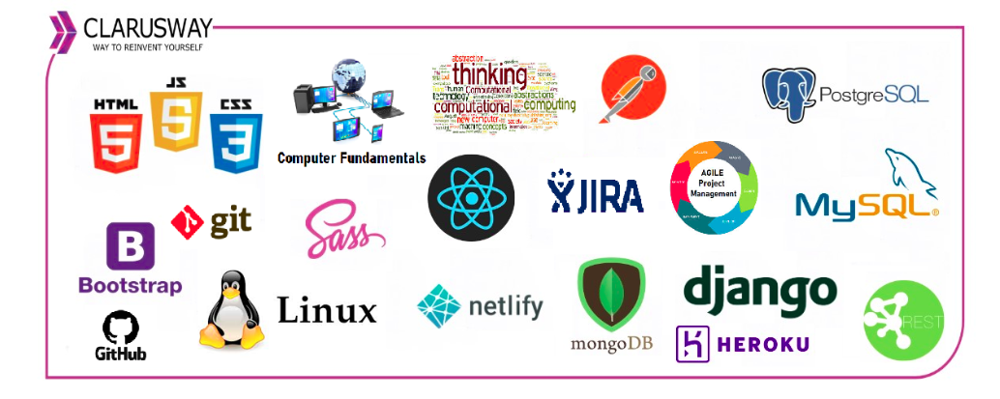

<center></center>
<br>

<center><h1> Django Class Notes</h1></center>
<p>Clarusway</p>
<br>


# Docker for Developers

### Nice to have VSCode Extentions:
- Djaneiro - Django Snippets
- Docker
- project-tree
- hadolint

### Needs
- Python
- pip
- Docker Desktop
- Docker Hub account

## Summary
- What is Docker?
- Docker Hub
- Dockerize Django
  - .dockerignore
  - Build
  - Share
  - Run
- Dockerize React
- Docker Compose
  - Pereperation
  - docker-compose file
  - Build
  - Cleanup
- Docker Best practices

<br>

## What is Docker?
Docker makes development efficient and predictable. It is working in my computer, but what about after deployment to the cloud?
Docker takes away repetitive configuration tasks and is used throughout the development lifecycle for fast, easy and portable application development.

- **Build**

Get a head start on your coding by leveraging Docker images to efficiently develop your own unique applications on any OS.  Create your multi-container application using Docker Compose.

- **Share**

Leverage Docker Trusted Content, including Docker Official Images and images from Docker Verified Publishers from the Docker Hub repository.
Innovate by collaborating with team members and other developers and by easily publishing images to Docker Hub.

- **Run**

Deliver multiple applications hassle free and have them run the same way on all your environments including design, testing, staging and production – desktop or cloud-native.
Deploy your applications in separate containers independently and in different languages. Reduce the risk of conflict between languages, libraries or frameworks.

## Docker Hub

## Dockerize Django

- Prepare Django project and push to github. 

- There is no need to create a virtual environment. The Docker container is a self contained, one purpose tool which just have enough resources to run our code.

- See the [Dockerfile reference](https://docs.docker.com/engine/reference/builder/).

- Docker operations are generally three stages. 
  - Build image from a Dockerfile,
  - Push image to registry for future uses,
  - Run image to create container.

- Let's dockerize our Django project.

- As a first step and a best practice, create a `.dockerignore` file on the same level with Dockerfile. For Django applications a standard .dockerignore file may be;
```
*.pyc
*.pyo
*.mo
*.db
*.css.map
*.egg-info
*.sql.gz
.cache
.project
.idea
.pydevproject
.idea/workspace.xml
.DS_Store
.git/
.sass-cache
.vagrant/
__pycache__
dist
docs
env/
venv/
logs
src/{{ project_name }}/settings/local.py
src/node_modules
web/media
web/static/CACHE
stats
Dockerfile
.dockerignore
.gitignore
```

### Build

- Create Dockerfile inside working directory;
```dockerfile
# Select a base image which suits your usecase
FROM python:3.10.8-slim-bullseye

# PYTHONDONTWRITEBYTECODE=1 env prevents Python from copying pyc files 
# to the container. 
ENV PYTHONDONTWRITEBYTECODE=1

# PYTHONUNBUFFERED=1 ensures that Python output is logged to 
# the terminal, making it possible to monitor Django logs in 
# realtime.
ENV PYTHONUNBUFFERED=1

WORKDIR /code

# Docker checks if layers can be reused, if it finds that there are 
# no changes to the requirements.txt file, it will jump straight 
# to the COPY instruction, which will be resolved in a matter of seconds. 
# With this tiny change, we speed up a lot the build process: No more 
# waiting for minutes between builds each time that we modify something 
# in our code.
COPY requirements.txt /code/requirements.txt

# Adding --no-cache-dir to the pip install command saves an 
# additional disk space, as this prevents pip from caching 
# downloads and caching wheels locally. Since you won't need 
# to install requirements again after the Docker image has 
# been created, this can be added to the pip install command.
RUN pip install -r requirements.txt --no-cache-dir

# Copy all the working directory to the container. Optionally a
# `.dockerignore` file can be used not to copy unrelated things
# to the continer and keep it smaller in size and less vulnerable
COPY . /code

CMD [ "python", "manage.py", "runserver", "0.0.0.0:8000" ]
```

- Build image using Dockerfile on the current directory;
```docker
docker build -t django-backend .
```

### Share

- To see how to manage Docker Hub repos see [documentation](https://docs.docker.com/docker-hub/repos/).

- To push an image to Docker Hub first login Docker Hub using your terminal;
```docker
docker login
```

- The prompt will ask for username and password of your Docker Hub account. Enter them correctly.

- The standard format of our image is `docker push <hub-user>/<repo-name>:<tag>`. So we have to tag our current image.
```docker
# docker tag SOURCE_IMAGE[:TAG] TARGET_IMAGE[:TAG]
docker tag django-backend stefanorafe/django-backend:v0.1
```

- Ready to push our image;
```docker
docker push stefanorafe/django-backend:v0.1
```

- Prune your images and run a new container using your published image! See the beauty and simplicity of the Docker.
```docker
docker run -d -p 8000:8000 stefanorafe/django-backend:v0.1
```

### Run

- Make a container from the image you just created with the tag `django-backend`;
```docker
docker run -d -p 8000:8000 django-backend
```

- Go to the Docker Desktop and open your app on the browser. Also you can simply go to the endpoint you published on your docker run command which is port 8000.

- See your application up and running. But if you test the app you will see you did not apply migrations and create db tables. So open a terminal and migrate db tables.


## Dockerize React

- A standard `.dockerignore` file for React project may be;
```
node_modules/
npm-debug.log
Dockerfile
.dockerignore
.git/
build/
env/
venv/
```

- Let's prepare Dockerfile for Django app;
```dockerfile
FROM node:19-slim
WORKDIR /code
COPY package.json /code/package.json

# COPY yarn.lock /code/yarn.lock ?????

# --loglevel verbose flag should output the logs in real time 
# and also save your log into npm-debug.log file.
RUN npm install

COPY . /code
CMD [ "npm", "start" ]
```

- Build image using Dockerfile on the current directory;
```docker
docker build -t react-frontend .
```

- Make a container from the image you just created with the tag `react-frontend`;
```docker
docker run -d -p 3000:3000 react-frontend
```

## Docker Compose

- Compose is a tool for defining and running multi-container Docker applications. With Compose, you use a YAML file to configure your application’s services. Then, with a single command, you create and start all the services from your configuration.

Compose works in all environments: production, staging, development, testing, as well as CI workflows. It also has commands for managing the whole lifecycle of your application:

  - Start, stop, and rebuild services,
  - View the status of running services,
  - Stream the log output of running services,
  - Run a one-off command on a service.

- The key features of Compose that make it effective are:

  - Have multiple isolated environments on a single host,
  - Preserves volume data when containers are created,
  - Only recreate containers that have changed,
  - Supports variables and moving a composition between environments.

- Compose specification concepts with a concrete example application is in the [documentation](https://docs.docker.com/compose/compose-file/#illustrative-example).

### Pereperation

- First, we need to prepare our folder structure. Create a new project main directory. Under that directory create two new directories named `api` and `client`. Put everything inside django project folder to the api/ and React project folder to client/.

- Remove CMD line from Django Dockerfile. We will handle that command with docker-compose.yml using gunicorn.

### docker-compose file

- Create a `docker-compose.yml` file under main directory at the same level with api/ and client/;
```yml
# On the top line we set the most recent version of Docker Compose 
# which is currently 3.9
version: '3.9'

# Specify which services (or containers) we want to have running 
# within our Docker host.
services:

  client:
    build: ./client
    # container_name: client
    depends_on:
      - api
    ports:
      - 3000:3000
    # restart: "on-failure"
    volumes:
      - ./client:/code/client
      - node-modules:/code/client/node_modules

  api:
    build: ./api
    command: sh -c 'python manage.py makemigrations &&
                    python manage.py migrate --no-input &&
                    python manage.py collectstatic --no-input &&
                    gunicorn main.wsgi:application --bind 0.0.0.0:8000'
    depends_on:
      - db
    env_file:
      - .env
    # image: django_app
    ports:
      - 8000:8000
    # restart: "on-failure"

    volumes:
      # The volumes mount automatically syncs the Docker filesystem 
      # with our local computer's filesystem. This if we make a change 
      # to the code within Docker it will automatically be synced with 
      # the local filesystem.
      - ./api:/code/api/

    #   - static_volume:/code/api/static/

  db:
    env_file:
      - .env
    image: postgres:14-bullseye
    ports:
      - 5432:5432
    # restart: "on-failure"
    volumes:
      - postgres_data:/var/lib/postgresql/data

volumes:
  node-modules:
  postgres_data:
#   static_volume:
```

- To understand the terminology, look at [documentation](https://docs.docker.com/compose/compose-file/compose-file-v3/).


### Build

Build the declared images and create containers with a single command;
```
docker-compose up
docker-compose up -d --build
```

- To see error messages look at logs in a container;
```
docker-compose logs api
docker-compose logs client
docker-compose logs db
```

### Cleanup

- To clean up infrastructure created by docker compose, including volumes;
```
docker-compose down -v
```

- To remove all stopped containers, all unused networks, all images without at least one container associated to them, all build cache use the command below;
```docker
docker system prune -a
```

## Docker Best practices

- Use explicit and deterministic Docker base image tags for containerized Python applications.
- Separate dependencies from source code.
- Use Python WSGI for production.
- Run containers with least possible privilege (and never as root).
- Handle unhealthy states of your application. 
- Find and fix security vulnerabilities in your Python Docker application image.
